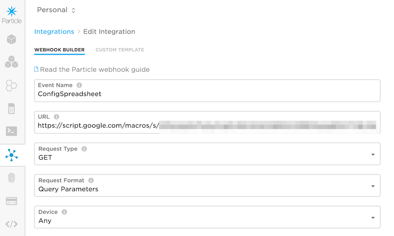
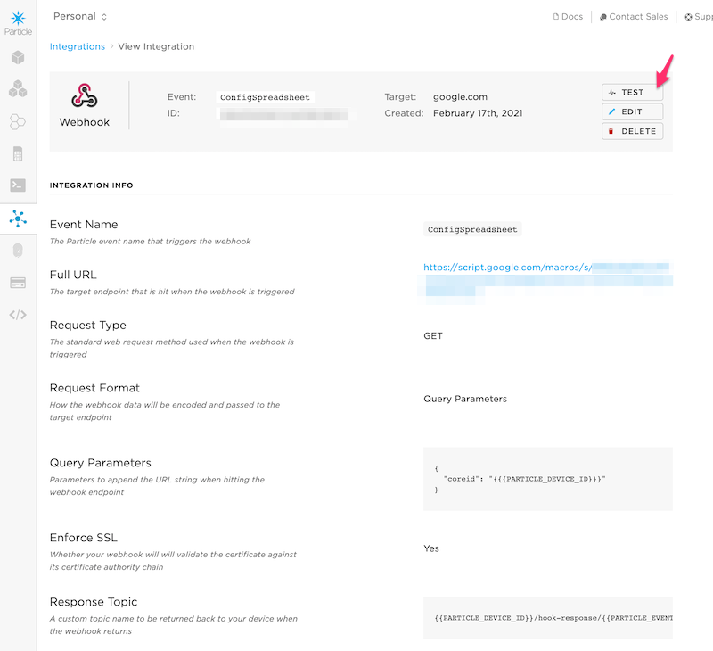

# Using Google Sheets with CloudConfigRK

This is a great option for storing per-device configuration for a set of devices in a Google Sheets spreadsheet. It makes adding and updating configuration easy, and you can see the values for your fleet at a glance. It also makes it easy to replicate settings across a group of devices easily.

It uses Apps Script, which is included in your G Suite subscription, so you don't need to purchase separate Google Cloud computing resources!

For more information, see [AN011 - Publish to Google Sheets](https://github.com/particle-iot/app-notes/tree/master/AN011-Publish-to-Google-Sheets) as this note is based on that, but for getting configuration instead of saving data.

If you're like to learn more about Google Apps Script, these two resources are a good starting point:

- [Overview of Apps Script](https://developers.google.com/apps-script/overview)
- [Codelab Tutorial](https://codelabs.developers.google.com/codelabs/apps-script-fundamentals-1/index.html)


## Device Configuration

### Create the spreadsheet

The first step is to create a regular Google G Suite Spreadsheet. In this case, I named mine **Device Configuration**.


I added four columns. The first column (A) must be the device ID, the others can be anything you want.

- deviceid
- name
- a
- b

### Create the script

Click on the **Tools** menu and select **Script Editor** this opens a new tab.


The first time you open the script there will be an empty function in the Code.gs tab. Replace it with this code:


```js
/**
 * @OnlyCurrentDoc
 */
function test() {
  var e = {};
  e.parameter = {};
  e.parameter.coreid = '1f00ffffffffffffffffffff';
  doGet(e);
}

function doGet(e) {
  // e.parameter.coreid
    
  var sheet = SpreadsheetApp.getActiveSheet();
  
  var range = sheet.getDataRange();
  var values = range.getValues();

  var result = {};
  
  for(var row = 0; row < values.length; row++) {
    if (values[row][0] == e.parameter.coreid) {
      // Found the row
      for(var col = 1; col < values[0].length; col++) {
        result[values[0][col]] = values[row][col];
      }
      break;
    }
  }

  console.log('result', result);

  return ContentService.createTextOutput(JSON.stringify(result))
    .setMimeType(ContentService.MimeType.JSON);
}
```

The `e.parameter.coreid` must match a device ID in the spreadsheet in column A. It's only used for testing.

### Script details

The `test()` function is used for testing within the Script Editor, described below.

When the `doGet()` function is called, it will have GET arguments from the webhook. These are parsed into `e.parameter` before calling `doGet()`.

The standard Particle webhook files are included:

- `event`: The event name
- `data`: The data as a string
- `coreid`: The Device ID (24-character hex)
- `published_at`: The date and time the event was published as a string in ISO 8601 format


This bit of code gets the active spreadsheet and reads the whole thing into nested JSON arrays in `values`. The expectation is that the spreadsheet won't be that large. If you have a very large number of devices you should use something more efficient than a spreadsheet!

```js
var sheet = SpreadsheetApp.getActiveSheet();

var range = sheet.getDataRange();
var values = range.getValues();
```

This code iterates through the spreadsheet to find the row with the matching device ID. When that row is found, it then creates a JSON object by taking the label in row 1 as the JSON key and the value in this row as the JSON value. This is repeated for all of the columns B and higher.

```js
var result = {};
  
for(var row = 0; row < values.length; row++) {
    if (values[row][0] == e.parameter.coreid) {
        // Found the row
        for(var col = 1; col < values[0].length; col++) {
            result[values[0][col]] = values[row][col];
        }
        break;
    }
}

```

This will create this JSON data in `result`:

```json
{
    "name": "test2",
    "a": 1234,
    "b": "test string 1"
}
```

This prints the value in the debug log, handy during development but you may want to remove it later.

```js
console.log('result', result);
```

And finally this returns `result` as JSON data to the webhook.

```js
return ContentService.createTextOutput(JSON.stringify(result))
    .setMimeType(ContentService.MimeType.JSON);
```

These lines at the top are there to signal that if authorization is requested, only the current document is accessed, not everything in your Google Drive.

```js
/**
 * @OnlyCurrentDoc
 */
```

### Run a test in the script editor

Save the script (Command-S (Mac) or Ctrl-S (Windows)).

Using the `test()` function makes it much easier to troubleshoot code! Exceptions are shown in the Script Editor and **View - Logs** shows the debugging log. 

```js
function test() {
  var e = {};
  e.parameter = {};
  e.parameter.coreid = '1f00ffffffffffffffffffff';
  doGet(e);
}
```

In the **Script Editor** make sure **test** is the selected function (1) and click **Run** (2). 


The results will be shown in the **Execution log** (3).

Note that you must always run a test at least once when creating a new script! As part of the running process, it will prompt you do authorize access to this file. If you don't authorize, the webhook won't work.

### Deploy the script

Just saving the script does not update the active version. You must deploy it for the changes to take effect!

Use the big blue **Deploy** button in the upper right of the window. Select **New deployment**. Use this option for creating a new version as well as releasing an updated version.

The first time you deploy, click the **gear** (1) and then **Web App** (2).


In the New Deployment screen verify a few settings:

- Set the description to whatever you'd like. Since you will set this name on every deployment you might want to use something like "Version 1" or what you changed in that version instead.
- Set **Execute as** to **Me**. This is required!
- Set **Who has access** to **Anyone**. This sounds scary, but is necessary from a webhook as there is no way to set the authentication there. Fortunately, this will only grant access to this document, not your entire Google drive.


After clicking **Deploy** you'll get a screen with details about your deployment. Copy the web app URL as you'll need it in the next step.


For more information about deploying webapps, see the [Google apps script page](https://developers.google.com/apps-script/guides/web).

Also note that you cannot use the Test Deployment URL in a webhook. That requires authorization to use it, so it won't work from a webhook.


### Create the Particle webhook

The next step is to create the webhook. 

- Log into the [Particle console](https://console.particle.io) and open **Integrations**.

- Use the **New Integration** button (+ icon) to create a new integration.

- Select the **Webhook** option for the kind of integration to create.



- Set the **Event Name**. For this test I used **ConfigSpreadsheet** but you can use any event name as long as you match the webhook and device firmware. Remember that the event name is a prefix, so the event name sheetTest10 will also trigger this event!

- Set the **URL** field to the URL of the webapp you just deployed. Remember to keep this a secret!

- Set the **Request Type** to **GET**. 

- Set the **Request Format** to **Query Parameters**.


- Click **Advanced Settings**.

- Under **Query Parameters** select **Custom**.

- Enter: `coreid` > `{{{PARTICLE_DEVICE_ID}}}`. Note the use of triple curly brackets. 

- Under ***Webhook Responses** enter a **Response Topic**: 

```
{{PARTICLE_DEVICE_ID}}/hook-response/{{PARTICLE_EVENT_NAME}}
```

- Save the webhook.


- In the **View Integration** window, use the **Test** button to test your new webhook



- If this succeeds, you can move on to device firmware.


### Device Firmware

Here's the device firmware example:

```cpp
#include "CloudConfigRK.h"

SerialLogHandler logHandler;

SYSTEM_THREAD(ENABLED);

const size_t EEPROM_OFFSET = 0;

void logJson();

void setup() {
    // This two lines are here so you can see the debug logs. You probably
    // don't want them in your code.
    waitFor(Serial.isConnected, 10000);
    delay(2000);

    // You must call this from setup!
    CloudConfig::instance()
        .withDataCallback([]() {
            Log.info("dataCallback");        
            logJson();
        })
        .withUpdateFrequencyAtRestart()
        .withUpdateMethod(new CloudConfigUpdateWebhook("ConfigSpreadsheet"))
        .withStorageMethod(new CloudConfigStorageEEPROM<256>(EEPROM_OFFSET))
        .setup();
}

void loop() {
    // You must call this from loop!
    CloudConfig::instance().loop();
}


void logJson() {
    Log.info("configuration:");

    JSONObjectIterator iter(CloudConfig::instance().getJSONValue());
    while(iter.next()) {
        Log.info("  key=%s value=%s", 
          (const char *) iter.name(), 
          (const char *) iter.value().toString());
    }

}
```

For testing purposes, it queries the data on every restart, including after HIBERNATE sleep. You probably will want to use something like:

```cpp
        .withUpdateFrequency(24h)
```

instead of 

```cpp
        .withUpdateFrequencyAtRestart()
```

Also, if you changed your event name in the webhook, be sure to update:

```cpp
        .withUpdateMethod(new CloudConfigUpdateWebhook("ConfigSpreadsheet"))
```

---

## Update Button

This example adds a button to update the selected device's configuration! 


This example builds off the setup from the previous tutorial so if you have not completed the previous steps you should do that first.

This is a really neat technique, however it's probably best suited for home or developer use. It requires a Particle access token to be embedded in the Google apps script, so anyone who has the ability to open the script code would be able to obtain your access token.

- Open the Google Sheets spreadsheet **Device Configuration** from the previous example.

- From the **Insert** menu select **Drawing**. Using the **Shape** tool, draw a **Rounded Rectangle** and add text to make something that looks like a button.


- Save the drawing and move the button to a convenient location in your spreadsheet.

- From the **Tools** menu select **Script Editor** if not already opened, and edit the script to be:

```js
/**
 * @OnlyCurrentDoc
 */
function test() {
  var e = {};
  e.parameter = {};
  e.parameter.coreid = '1f00ffffffffffffffffffff';
  doGet(e);
}

function doGet(e) {
  // e.parameter.coreid
    
  var sheet = SpreadsheetApp.getActiveSheet();
  
  var range = sheet.getDataRange();
  var values = range.getValues();

  var result = {};
  
  for(var row = 0; row < values.length; row++) {
    if (values[row][0] == e.parameter.coreid) {
      // Found the row
      for(var col = 1; col < values[0].length; col++) {
        result[values[0][col]] = values[row][col];
      }
      break;
    }
  }

  console.log('result', result);

  return ContentService.createTextOutput(JSON.stringify(result))
    .setMimeType(ContentService.MimeType.JSON);
}

function updateSelected() {
  var sheet = SpreadsheetApp.getActiveSheet();

  var dataRange = sheet.getDataRange();
  var values = dataRange.getValues();

  var activeRange = sheet.getActiveRange();
  if (activeRange != null && activeRange.getNumRows() >= 1) {
    for(var row = activeRange.getRow() - 1; row < activeRange.getRow() + activeRange.getNumRows() - 1; row++) {
      if (row >= values.length) {
        break;
      }
      var deviceId = values[row][0];
      if (deviceId.length != 24) {
        continue;
      }

      var result = {};
      for(var col = 1; col < values[0].length; col++) {
        result[values[0][col]] = values[row][col];
      }
      console.log('row=' + row + ' deviceId=' + deviceId, result);

      // Update ConfigSpreadsheet to be the event name you are using if you changed it!
      // Make sure you leave the /0 at the end.
      var eventName = deviceId + '/hook-response/ConfigSpreadsheet/0';
      publishEvent(eventName, JSON.stringify(result));
    }
  }
}

function publishEvent(eventName, eventData) {
  if (!eventName) {
    eventName = 'testEvent';
  }
  if (!eventData) {
    eventData = 'testData';
  }
  var formData = {
    'name': eventName,
    'data': eventData,
    'access_token': 'xxxx'
  };
  var options = {
    'method' : 'post',
    'payload' : formData
  };
  UrlFetchApp.fetch('https://api.particle.io/v1/devices/events', options);
}

```

This script starts out the same as the previous script, then adds two new functions: updateSelected and publishEvent.

You will need an access token for your account. You will probably want to use the [Particle CLI](https://docs.particle.io/reference/developer-tools/cli/#particle-token-create) since you will probably want a token that does not expire. Keep this secure since it allows complete access to your account!

```
particle token create --never-expires
```


- Paste your access token in place of the 'xxxx' in the publishEvent function (1).

- Select **publishEvent** (2) as the function to test.

- Open the [Particle console](https://console.particle.io) Events tab if you don't already have it open.

- Click **Run** (3) to run the test.

- The first time you run this script, you will be prompted to authorize access to connect to an external service. This is normal, and required.


- You should see **testEvent** in the Particle console event log.


- If you changed the event name from **ConfigSpreadsheet** edit this line in the updateSelected function:

```
var eventName = deviceId + '/hook-response/ConfigSpreadsheet/0';
```

- Select a cell for a device in the spreadsheet (A2, for example).


- Select **updateSelected** (1) as the function to test.

- Click **Run** (2) to run the test.

- There should be a result in the execution log (3).


- And also in the Particle console event log!

- Click **Deploy** and do a **New deployment** of this script. The name isn't important, but you may want to name it something like "Add update selected" so you can remember what you changed in this deployment.

- Back in the spreadsheet, right click on the **Update selected** button and click the three dots icon.


- Select **Assign script**.


- In the Assign script dialog, enter **updateSelected**. Note that it's case-sensitive and must match the name of the function exactly.

- Click the **Update Selected** button and then check the Particle event log.

- If you have the Particle serial monitor open on your device, you should see something like:

```
0002815925 [app] INFO: updateData called {"name":"test2","a":1234,"b":"test string 1"}
0002815926 [app] INFO: dataCallback
0002815926 [app] INFO: configuration:
0002815926 [app] INFO:   key=name value=test2
0002815926 [app] INFO:   key=a value=1234
0002815926 [app] INFO:   key=b value=test string 1
```


