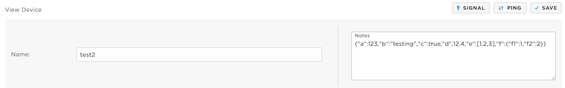
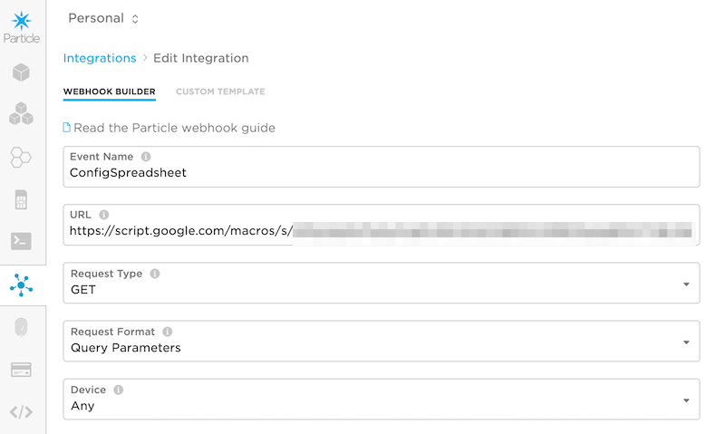
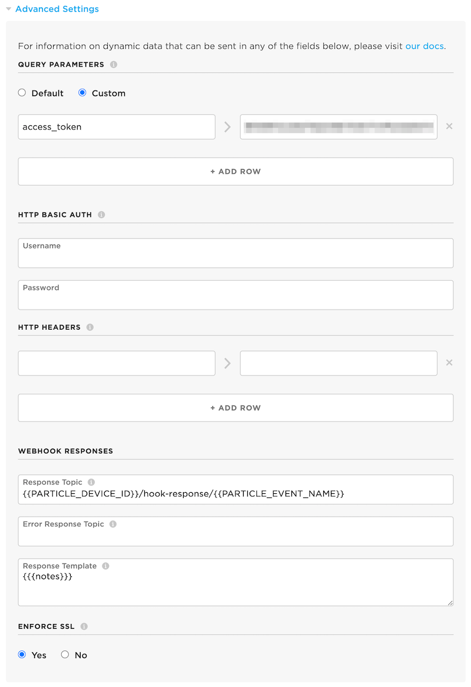
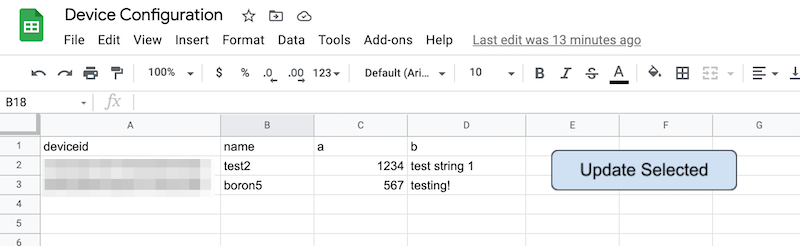

# CloudConfigRK

Store configuration settings locally with the ability to set from the cloud

- Github repository: https://github.com/rickkas7/CloudConfigRK
- License: MIT

The [full browsable API docs](https://rickkas7.github.io/CloudConfigRK/index.html) are available online as well as in HTML in the docs folder.

## Storage Methods

The storage methods provide a way to store the data locally so it's available immediately after restart, and to avoid having to get the data from the cloud as frequently. You can set an adjustable refresh period, if desired, or only fetch once.

### Retained Memory

Retained memory is preserved:

- Across reboot
- Across sleep modes including HIBERNATE

It is not preserved:

- When removing power (including use the Gen 3 EN pin)
- Most code flashes
- Most Device OS upgrades

There is around 3K of retained memory on most devices.

To use retained memory you create a global retained variable to store the data. The <256> parameter is the maximum size of the JSON data in characters. This can be up to 622 for function or publish, the maximum size of the payload. And equal amount of RAM is reserved, so you don't want to make this excessively large.

```cpp
retained CloudConfigData<256> retainedConfig;
```

From setup() initialize your updateMethod (function, subscription, webhook, etc.) and your storage method. In this case, retained memory.

```
void setup() {
    // You must call this from setup!
    CloudConfig::instance()
        .withUpdateMethod(new CloudConfigUpdateFunction("setConfig"))
        .withStorageMethod(new CloudConfigStorageRetained(&retainedConfig, sizeof(retainedConfig)))
        .setup();
}
```

Don't forget to call from loop() as well!

```
void loop() {
    // You must call this from loop!
    CloudConfig::instance().loop();
```


### EEPROM

Emulated EEPROM is a good choice on Gen2 devices because it's preserved:

- Across reboot
- Across sleep modes including HIBERNATE
- When removing power (including use the Gen 3 EN pin)
- Most code flashes
- Most Device OS upgrades

There is around 3K of emulated EEPROM on most devices. 

On Gen 3 devices, it may make more sense to use the flash file system file option instead. On the Argon, Boron, B Series SoM, and Tracker SoM, emulated EEPROM is just a file on the flash file system, so there is no efficiency advantage to using EEPROM over files.

From setup() initialize your updateMethod (function, subscription, webhook, etc.) and your storage method. In this case, EEPROM.

The <256> parameter is the maximum size of the JSON data in characters. This can be up to 622 for function or publish, the maximum size of the payload. And equal amount of RAM is reserved, so you don't want to make this excessively large.

```cpp
size_t EEPROM_OFFSET = 0;

void setup() {
    // You must call this from setup!
    CloudConfig::instance()
        .withUpdateMethod(new CloudConfigUpdateFunction("setConfig"))
        .withStorageMethod(new CloudConfigStorageEEPROM<256>(EEPROM_OFFSET))
        .setup();
}
```

When using EEPROM you must specify the start offset (EEPROM_OFFSET, 0, in this example). Note that the total EEPROM required is sizeof(CloudConfigDataHeader) + SIZE bytes as there is a 20 byte header before the data. Thus for the <256> example, it will use 256 + 20 = 276 bytes of EEPROM so you can't use anything from offset 0 to 276. Of course you can change the offset to a different part of EEPROM if you are using offset 0 already.


### Flash File System File

On Gen 3 devices (Argon, Boron, B Series SoM, and Tracker SoM) running Device OS 2.0.0 or later, you can store the data in a file on the flash file system.

The file system is 2 MB, except on the Tracker SoM, where it's 4 MB. 

Using a file is easy, just pass the pathname to the CloudConfigStorageFile constructor.

The <256> parameter is the maximum size of the JSON data in characters. This can be up to 622 for function or publish, the maximum size of the payload. And equal amount of RAM is reserved, so you don't want to make this excessively large.

```cpp
void setup() {
    // You must call this from setup!
    CloudConfig::instance()
        .withDataCallback(logJson)
        .withUpdateMethod(new CloudConfigUpdateFunction("setConfig"))
        .withStorageMethod(new CloudConfigStorageFile<256>("/usr/cloudconfig"))
        .setup();
}
```


### Static Data in Code

This option does not allow for updating from the cloud, but does provide a way to store the configuration as a string constant in the program flash. This is convenient when you want to be able to use a similar code base with both hardcoded and cloud-based configuration settings.

```cpp
// {"a":123,"b":"testing","c":true,"d",12.4,"e":[1,2,3],"f":{"f1":1,"f2":2}}
const char *testConfig = "{\"a\":123,\"b\":\"testing\",\"c\":true,\"d\",12.4,\"e\":[1,2,3],\"f\":{\"f1\":1,\"f2\":2}}";

void setup() {
    // You must call this from setup!
    CloudConfig::instance()
        .withStorageMethod(new CloudConfigStorageStatic(testConfig))
        .setup();
}
```


## Data Update Methods

The data update methods allow the data to be updated from the cloud.

### Function

The configuration data can be updated by making a Particle.function call to the device. Since it's a "push" method, there's no way for the device to request it be sent the configuration data, so it's best suited for EEPROM or file storage methods.

Function update is a good choice if:

- You will be pushing the changes from your own server. 
- Each device has its own configuration.
- You want confirmation that the device received the update.
- The device may be in sleep mode or offline.
- You are using unclaimed product devices (also works if claimed).


### Subscription

Subscription is a good choice if:

- You want to update all devices at once efficiently.
- Devices are generally always online.

Note that devices must be claimed to an account to use subscriptions; you cannot use subscriptions with unclaimed product devices.

Since it's a "push" method, there's no way for the device to request it be sent the configuration data, so it's best suited for EEPROM or file storage methods. The webhook method is based on subscription, but works as both "push" and "pull" so it can both request the current configuration and receive configuration updates spontaneously.

### Webhook

There are two examples of using a webhook: Device Notes and Google Sheets. You can easily base your own webhook-based system for getting configuration data from your own server using this method.

### Device Notes



The Device Notes example allows you to store the configuration data for each device in the Device Notes field in the console. One of the major benefits is that you don't need any external services and you can edit the data in the Particle console, though you do need to edit the JSON data as text. See also the Google Sheets example, below.

- Create an access token for your account. You will probably want to use the [Particle CLI](https://docs.particle.io/reference/developer-tools/cli/#particle-token-create) since you will probably want a token that does not expire. Keep this secure since it allows complete access to your account!

```
particle token create --never-expires
```

- Log into the [Particle console](https://console.particle.io) and open **Integrations**.

- Use the **New Integration** button (+ icon) to create a new integration.

- Select the **Webhook** option for the kind of integration to create.



- Set the **Event Name**. For this test I used **CloudConfigDeviceNotes** but you can use any event name as long as you match the webhook and device firmware. Remember that the event name is a prefix, so the event name CloudConfigDeviceNotes2 would also trigger this event!

- Set the **URL** field to: `https://api.particle.io/v1/devices/{{PARTICLE_DEVICE_ID}}`

- Set the **Request Type** to **GET**. 

- Set the **Request Format** to **Query Parameters**.



- Click **Advanced Settings**.

- Under **Query Parameters** select **Custom**.

- Enter: `access_token` > *your access token* that you created above.

- Under ***Webhook Responses** enter a **Response Topic**: 

```
{{PARTICLE_DEVICE_ID}}/hook-response/{{PARTICLE_EVENT_NAME}}
```

- Under **Response Template** enter:

```
{{{notes}}}
```

Be sure to use triple curly brackets for this!

- Save the webhook.

- In the **Devices** tab in the console, open your device.

- Check the **Edit** button in the upper right.

- Enter this in the **Devices Notes** field:

```
{"a":123,"b":"testing","c":true,"d",12.4,"e":[1,2,3],"f":{"f1":1,"f2":2}}
```


### Device Firmware

This is the firmware to test device notes. It stores the data in retained memory, but you could also use EEPROM or File.

```cpp
#include "CloudConfigRK.h"

SerialLogHandler logHandler;

SYSTEM_THREAD(ENABLED);

// Store in Device Notes
// {"a":123,"b":"testing","c":true,"d",12.4,"e":[1,2,3],"f":{"f1":1,"f2":2}}

retained CloudConfigData<256> retainedConfig;

void logJson();

void setup() {
    // This two lines are here so you can see the debug logs. You probably
    // don't want them in your code.
    waitFor(Serial.isConnected, 10000);
    delay(2000);

    // You must call this from setup!
    CloudConfig::instance()
        .withDataCallback([]() {
            Log.info("dataCallback");        
            logJson();
        })
        .withUpdateFrequency(5min)
        .withUpdateMethod(new CloudConfigUpdateWebhook("CloudConfigDeviceNotes"))
        .withStorageMethod(new CloudConfigStorageRetained(&retainedConfig, sizeof(retainedConfig)))
        .setup();
}

void loop() {
    // You must call this from loop!
    CloudConfig::instance().loop();
}


void logJson() {
    if (CloudConfig::instance().getJSONValueForKey("a").isValid()) {
        Log.info("a=%d b=%s c=%s d=%lf",
            CloudConfig::instance().getInt("a"),
            CloudConfig::instance().getString("b"),
            CloudConfig::instance().getBool("c") ? "true" : "false",
            CloudConfig::instance().getDouble("d"));

        JSONValue array = CloudConfig::instance().getJSONValueForKey("e");
        JSONArrayIterator iter(array);
        for(size_t ii = 0; iter.next(); ii++) {
            Log.info("%u: %s", ii, iter.value().toString().data());
        }

        JSONValue obj = CloudConfig::instance().getJSONValueForKey("f");
        Log.info("f1=%d f2=%d",
            CloudConfigStorage::getJSONValueForKey(obj, "f1").toInt(),
            CloudConfigStorage::getJSONValueForKey(obj, "f2").toInt());
    }
    else {
        Log.info("no config set");
    }

}

```

### Google Sheets

This is a great option for storing per-device configuration for a set of devices in a Google Sheets spreadsheet. It makes adding and updating configuration easy, and you can see the values for your fleet at a glance. 



The setup process is a bit involved, so it's in a [separate page](GoogleSheets.md). However, once you've got it set up, updating configuration values is as easy as editing a Google spreadsheet. Also, it uses Apps Script, which is included in your G Suite subscription, so you don't need to purchase separate Google Cloud computing resources!

The second part of the tutorial adds the **Update Selected** button so you can send the configuration to selected devices (that are online) immediately!


### Static Data

This storage method doesn't use the cloud at all and instead has the configuration as a static string in code.

This is mainly so you can use the same code base for cloud or local storage, swappable at compile time. It's a bit of overkill for normal use.
 
## Version History

### 0.0.2 (2021-02-21)

- Fixed a bug where EEPROM wasn't saved correct (eepromOffset not stored)